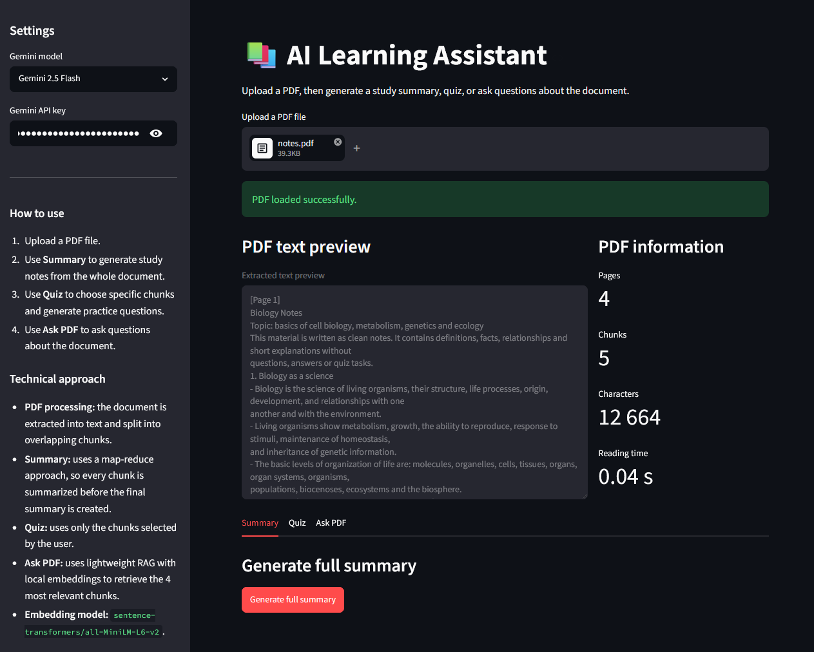
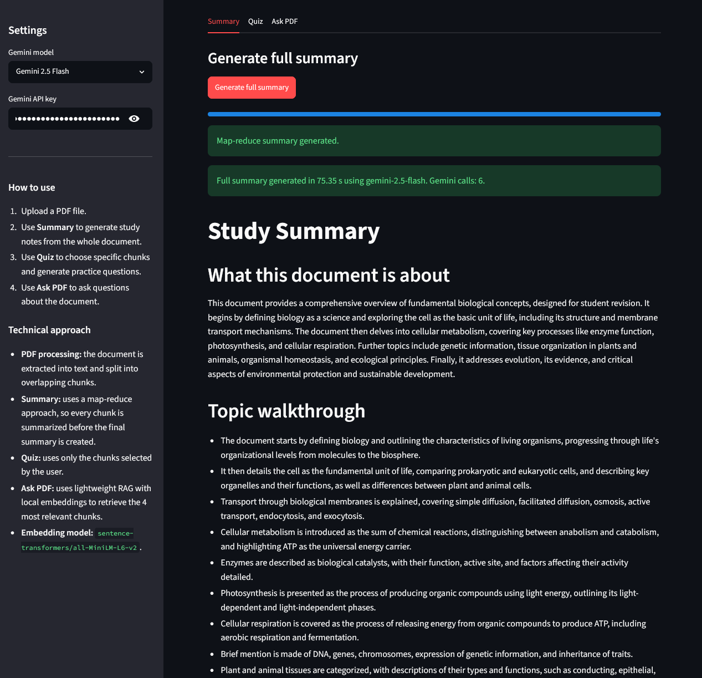
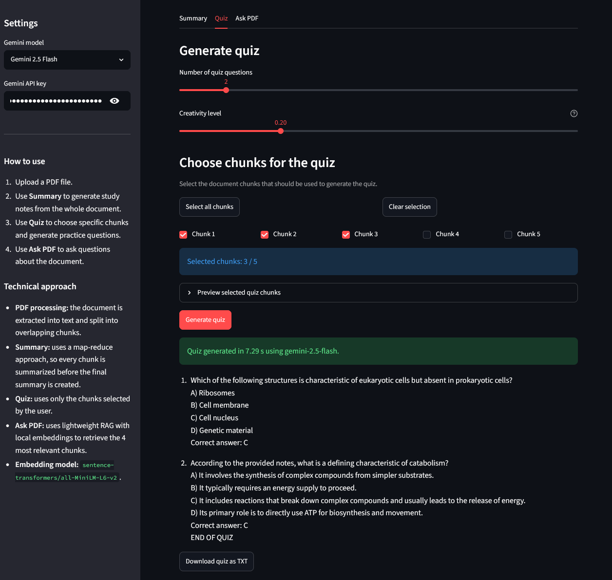
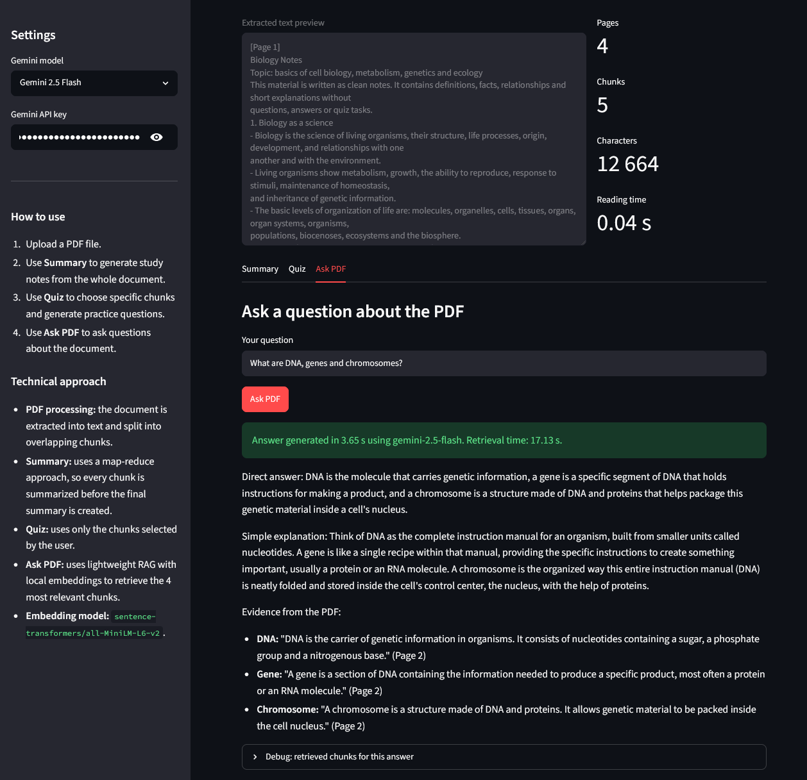

# AI Learning Assistant 📚

AI Learning Assistant is a **Streamlit web application** built to support studying from PDF documents. Users can upload learning materials, preview the extracted text, generate structured study summaries, create multiple-choice quizzes from selected document chunks, and ask questions about the uploaded content.

The application uses a modular pipeline: **PDF text extraction**, **text cleaning**, **overlapping chunk generation**, **Gemini-based text generation**, and **lightweight retrieval-augmented question answering**. For Q&A, local sentence-transformer embeddings are used to retrieve the most relevant chunks before passing the context to Gemini, helping keep answers focused on the source document.

## Features

### PDF Processing

- Upload PDF files directly through the Streamlit interface
- Extract text from readable PDF pages using `pypdf`
- Clean extracted text by normalizing whitespace and line breaks
- Split long documents into overlapping chunks
- Preserve page markers in the extracted text
- Display a PDF text preview
- Show document statistics, including page count, chunk count, character count and reading time

### Study Summary Generation

- Generate a full study summary from the entire uploaded PDF
- Use a map-reduce summarization approach:
  - summarize each document chunk separately
  - combine partial summaries into one final study summary
- Display progress while chunks are being summarized
- Show summary generation time and the number of Gemini calls used
- Produce structured study output with:
  - document overview
  - topic walkthrough
  - main study notes
  - key definitions
  - important processes and comparisons
  - high-yield revision facts
- Provide a debug section with partial summaries for individual chunks
- Allow users to download the final summary as a TXT file

### Quiz Generation

- Generate multiple-choice quizzes from selected PDF chunks
- Let users choose the number of quiz questions
- Allow users to adjust quiz creativity with a temperature slider
- Let users manually select which chunks should be used for quiz generation
- Provide quick controls to select all chunks or clear the selection
- Display the number of currently selected chunks
- Show a preview of selected chunks before generation
- Generate questions with four answer options and one correct answer
- Display quiz generation time
- Allow users to download the generated quiz as a TXT file

### Ask PDF / RAG Q&A

- Ask natural language questions about the uploaded PDF
- Use local sentence-transformer embeddings for semantic retrieval
- Retrieve the most relevant chunks before generating an answer
- Use Gemini to answer questions based only on retrieved PDF fragments
- Display retrieval time and answer generation time separately
- Return answers in a structured format:
  - direct answer
  - simple explanation
  - evidence from the PDF
- Show a retrieved-chunks debug panel
- Display source chunk indexes for retrieved fragments
- Display semantic similarity scores for retrieved chunks
- Allow users to inspect the exact chunks used as context for the answer

### User Interface and State Handling

- Clean Streamlit interface with separate tabs for Summary, Quiz and Ask PDF
- Sidebar with Gemini model selection and API key input
- Support for API keys entered in the UI, Streamlit secrets or environment variables
- Sidebar instructions explaining how to use the app
- Sidebar technical overview of the processing pipeline
- Store generated summaries, quizzes and Q&A answers in Streamlit session state
- Automatically reset generated outputs when a new PDF is uploaded
- Automatically clear old quiz selections when the uploaded PDF changes
- Validate required inputs before generation
- Show user-friendly error messages for missing API keys, empty questions or missing chunk selections

## Screenshots

### PDF Upload and Document Preview

The app extracts text from the uploaded PDF, displays a preview, and shows basic document statistics such as page count, chunk count, character count, and reading time.



### Study Summary Generation

The Summary tab generates structured study notes from the whole document using a map-reduce approach. Partial chunk summaries are combined into a final study summary.



### Quiz Generator

The Quiz tab allows users to select specific document chunks, choose the number of questions, adjust the creativity level, and generate multiple-choice questions.



### Ask PDF with RAG

The Ask PDF tab retrieves the most relevant chunks using local embeddings and uses them as context for Gemini. The app also displays retrieval and generation time for transparency.



## How It Works

1. The user uploads a PDF document through the Streamlit interface. The app then reads the uploaded file and prepares it for text extraction.

2. The PDF text is extracted using `pypdf`. The app reads all readable pages, preserves page markers where possible, and displays a preview of the extracted text together with basic document statistics.

3. The extracted text is cleaned and split into overlapping chunks. Cleaning removes unnecessary whitespace and formatting noise, while chunking makes longer documents easier to process and helps preserve context between neighboring fragments.

4. For study summaries, the app uses a map-reduce approach. Each chunk is summarized separately first, and then Gemini combines the partial summaries into one structured final study summary with key definitions, topic walkthrough, study notes, comparisons, and high-yield facts.

5. For quiz generation, the user selects which chunks should be used as source material. Gemini then generates multiple-choice questions based only on those selected fragments, with four answer options and one correct answer for each question.

6. For Ask PDF, the app uses lightweight retrieval-augmented generation. Local sentence-transformer embeddings are created for the document chunks, the user question is compared against those chunks using semantic similarity, and only the most relevant fragments are passed to Gemini as context.

7. The app includes debug and transparency features. Users can inspect selected quiz chunks, retrieved Q&A chunks, similarity scores, retrieval time, generation time, and partial summaries used during the map-reduce summarization process.

## Project Structure

```text
AI-Learning-Assistant/
├── app.py              # Main Streamlit entry point
├── config.py           # Configuration values, model options, defaults, and session state keys
├── ui.py               # Sidebar, API key input, session state setup, and PDF upload handling
├── display_utils.py    # Streamlit display helpers, PDF preview, debug views, and download buttons
├── pdf_utils.py        # PDF text extraction, text cleaning, and overlapping chunk generation
├── gemini_utils.py     # Gemini API key handling, client creation, and text generation helper
├── rag_utils.py        # Local embeddings, semantic similarity scoring, and relevant chunk retrieval
├── prompts.py          # Prompt templates for summaries, quizzes, and PDF question answering
├── summary_tab.py      # Summary tab logic and map-reduce summary generation
├── quiz_tab.py         # Quiz tab logic, chunk selection, and quiz generation
├── qa_tab.py           # Ask PDF tab logic, RAG retrieval, and answer generation
├── requirements.txt    # Python dependencies
├── assets/             # Screenshots used in the README
├── LICENSE             # Project license
└── README.md           # Project documentation
```

The project is organized into separate modules for the main Streamlit app, PDF processing, Gemini integration, prompt templates, RAG retrieval, UI helpers, and each application tab. This keeps the code easier to maintain and makes the responsibilities of each file clear.

## Technologies

- **Python** - core programming language used for the application logic
- **Streamlit** - web interface, tabs, sidebar, file upload, session state, and interactive controls
- **Google Gemini API** - text generation for summaries, quizzes, and PDF-based answers
- **pypdf** - PDF text extraction from uploaded documents
- **sentence-transformers** - local embedding framework used for semantic chunk retrieval
- **NumPy** - vector operations and similarity scoring for retrieved chunks

## Models

- **Gemini 2.5 Flash** - main Gemini model option for text generation
- **Gemini 2.5 Flash-Lite** - lighter Gemini model option available in the sidebar
- **sentence-transformers/all-MiniLM-L6-v2** - local embedding model used for lightweight RAG

## How to Run

```bash
git clone https://github.com/mateusz-zarebski/AI-Learning-Assistant.git
cd AI-Learning-Assistant

python -m venv .venv
.venv\Scripts\activate

pip install -r requirements.txt
streamlit run app.py
```

## Gemini API Key

This app requires a Gemini API key to generate summaries, quizzes, and answers.

You can get a Gemini API key from Google AI Studio: https://aistudio.google.com/app/apikey

After running the app, paste your API key into the sidebar field labeled `Gemini API key`.

---
⭐ **Star if you like the project!**  

**Author:** Mateusz Zarebski  
[GitHub Profile](https://github.com/mateusz-zarebski) | [Portfolio Overview](https://github.com/mateusz-zarebski/portfolio)


